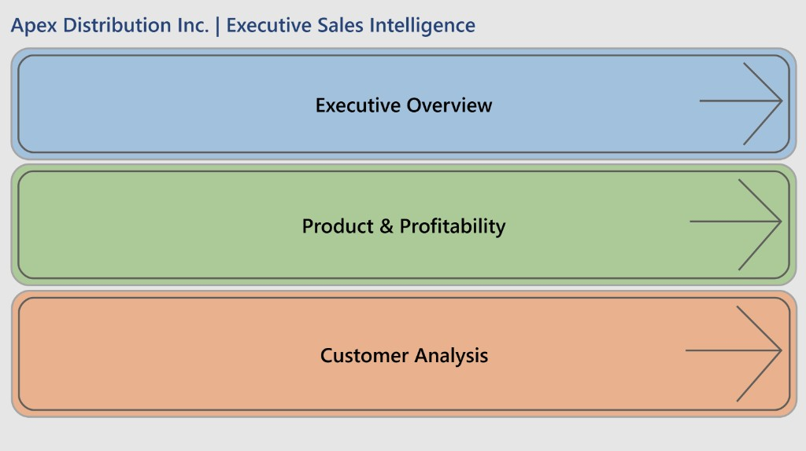
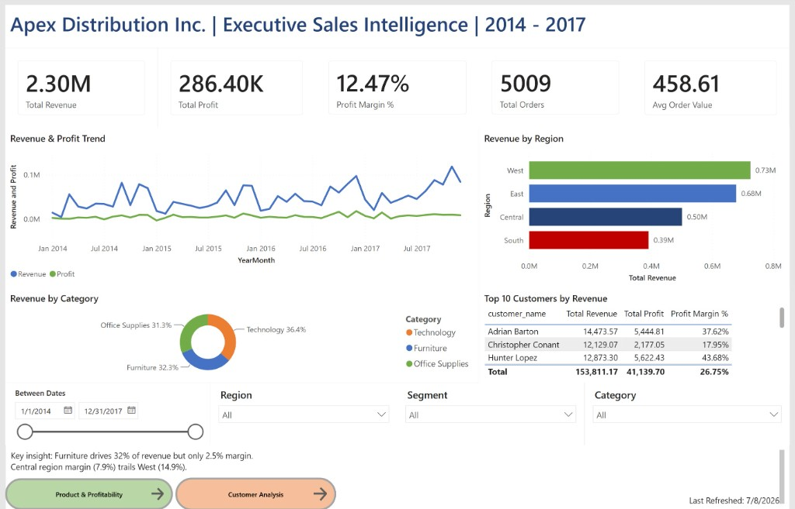
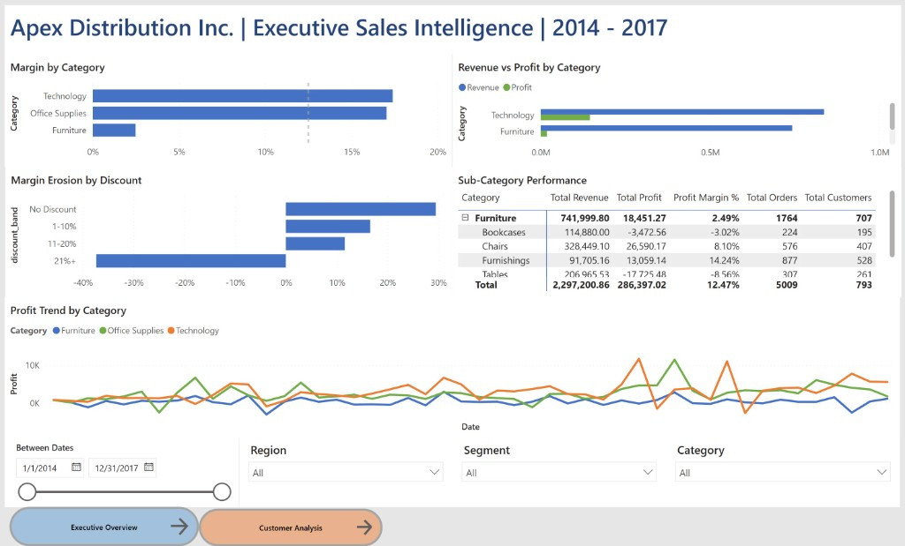
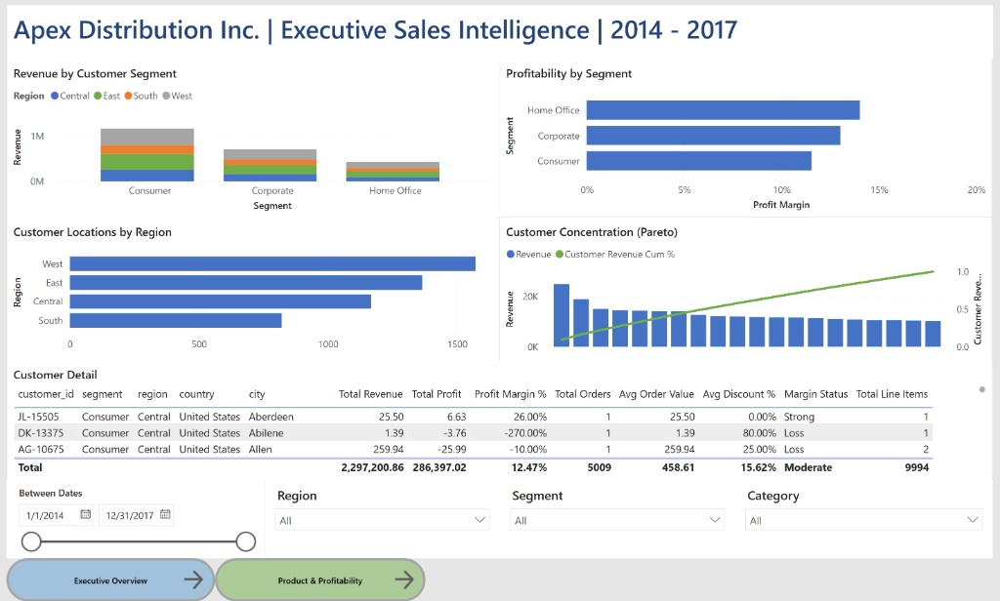

# Executive Sales Intelligence Dashboard

> End-to-end business intelligence project: raw data → SQL database → analytics → Power BI executive dashboard.

**Company:** Apex Distribution Inc. (fictional framing of Superstore sample data)  
**Status:** Complete — ETL pipeline + Power BI executive dashboard

---

## Executive Summary

This project demonstrates a complete analytics workflow used in real corporate BI teams. Raw sales transaction data is ingested, validated, modeled in a star schema, analyzed with SQL, and delivered through an executive Power BI dashboard — answering questions about revenue, profitability, customer segments, and product performance.

---

## Business Problem

Apex Distribution's leadership lacks a unified view of sales performance across regions, customer segments, and product categories. This project builds the data pipeline and dashboard to answer:

- How much revenue and profit are we generating, and what is our margin?
- Which regions, segments, and categories are growing or declining?
- Which customers and products drive the most value?
- How do discounts affect profitability?

See [docs/business_problem.md](docs/business_problem.md) for full context.

---

## Tools Used

| Tool | Purpose |
|------|---------|
| **Python** | Data validation, EDA, export automation |
| **SQL (SQLite)** | Schema design, ETL, analytical queries |
| **pandas** | Data inspection and transformation |
| **Power BI** | Executive dashboard and DAX measures |
| **Git / GitHub** | Version control and portfolio hosting |
| **Markdown** | Project documentation |

---

## Dataset Source

| Attribute | Detail |
|-----------|--------|
| **Dataset** | [Tableau Superstore Sample](https://community.tableau.com/s/question/0D54T00000CWeX8SAL/sample-superstore-sales-excelxls) |
| **File** | `data/raw/superstore_sales.csv` |
| **Rows** | 9,994 order line items |
| **Period** | January 2014 – December 2017 |
| **License** | Public sample data (Tableau) — used for educational/portfolio purposes |
| **Attribution** | Original data © Tableau Software; reframed as Apex Distribution Inc. |

**Why this dataset:** Contains Sales, Profit, Discount, Region, Segment, and Category fields — everything needed for executive KPIs, margin analysis, and dimensional modeling.

---

## Project Architecture

```
┌─────────────┐    ┌──────────────┐    ┌─────────────┐    ┌──────────────┐    ┌───────────┐
│  Raw CSV    │───▶│   Staging    │───▶│ Star Schema │───▶│  SQL Views   │───▶│ Power BI  │
│  data/raw/  │    │  stg_* tables│    │ dim + fact  │    │ vw_* views   │    │ Dashboard │
└─────────────┘    └──────────────┘    └─────────────┘    └──────────────┘    └───────────┘
       │                                        ▲
       └──────── Python validation ─────────────┘
```

See [docs/methodology.md](docs/methodology.md) for the full pipeline description.

---

## Key Questions Answered

1. What are total revenue, profit, and profit margin?
2. How do sales trend month-over-month and year-over-year?
3. Which regions and customer segments perform best?
4. Which product categories have the highest/lowest margins?
5. What is the impact of discounting on profitability?
6. Who are the top customers by revenue and profit?

---

## Dashboard Preview

| Home | Executive Overview | Product & Profitability | Customer Analysis |
|------|--------------------|-------------------------|-------------------|
|  |  |  |  |

> Screenshots from Power BI Desktop. Full build guide: [powerbi/BUILD_GUIDE.md](powerbi/BUILD_GUIDE.md).

---

## Main Insights

| Metric | Value |
|--------|-------|
| Total Revenue | $2,297,201 |
| Total Profit | $286,397 |
| Profit Margin | 12.5% |
| Total Orders | 5,009 |
| Date Range | 2014 – 2017 |

1. **Furniture is a margin trap** — 32% of revenue but only 2.5% margin; Tables sub-category loses $17.7K
2. **Discounts above 20% produce -37% margin** — 1,393 line items are deeply unprofitable
3. **Central region underperforms** at 7.9% margin despite $501K in revenue

See [docs/insights.md](docs/insights.md) for full analysis with recommended actions.

---

## How to Run the Project

### Prerequisites

- Python 3.10+
- Power BI Desktop (for dashboard)
- Git

### Setup

```bash
# Clone the repository
git clone https://github.com/YOUR_USERNAME/sales-intelligence-dashboard.git
cd sales-intelligence-dashboard

# Create virtual environment
python -m venv venv
source venv/bin/activate        # macOS/Linux
# venv\Scripts\activate         # Windows

# Install dependencies
pip install -r requirements.txt
```

### Run the Pipeline

```bash
# 1. Validate raw data
python python/data_validation.py

# 2. Run full ETL (schema → load → transform → views)
python python/run_pipeline.py

# 3. Export CSVs for Power BI
python python/export_for_powerbi.py

# 4. Import data/exports/*.csv into Power BI Desktop
#    See powerbi/dashboard_notes.md for build guide
```

**Individual SQL scripts** (if running manually):

```bash
sqlite3 data/processed/sales_intelligence.db < sql/01_create_schema.sql
python python/run_pipeline.py          # preferred — handles load + transform + views
```

### Exploratory Analysis

```bash
jupyter notebook python/exploratory_analysis.ipynb
```

---

## Repository Structure

```
sales-intelligence-dashboard/
│
├── README.md                          # Project overview (this file)
├── requirements.txt                   # Python dependencies
├── .gitignore
│
├── data/
│   ├── raw/                           # Original CSV/Excel files (not committed)
│   ├── processed/                     # SQLite database
│   └── exports/                       # CSV files for Power BI
│
├── sql/
│   ├── 01_create_schema.sql           # Star schema DDL
│   ├── 02_load_data.sql               # Staging table load
│   ├── 03_clean_transform.sql         # ETL: staging → star schema
│   ├── 04_analysis_queries.sql        # Business analysis queries
│   └── 05_powerbi_views.sql           # Denormalized views for BI
│
├── python/
│   ├── data_validation.py             # Raw data quality checks
│   ├── run_pipeline.py                # End-to-end ETL orchestration
│   ├── exploratory_analysis.ipynb     # EDA notebook
│   └── export_for_powerbi.py          # Export views to CSV
│
├── powerbi/
│   ├── screenshots/                   # Dashboard screenshots
│   └── dashboard_notes.md             # Power BI build guide
│
├── docs/
│   ├── business_problem.md            # Stakeholder context
│   ├── data_dictionary.md             # Table/column definitions
│   ├── methodology.md                 # Pipeline documentation
│   ├── insights.md                    # Key findings
│   └── dashboard_design.md            # Dashboard wireframe + DAX
│
└── assets/
    └── architecture_diagram.png       # Pipeline diagram (optional)
```

---

## Future Improvements

- [x] Select and ingest Superstore dataset
- [x] Build star-schema ETL pipeline
- [x] Export Power BI-ready CSVs
- [x] Build Power BI executive dashboard in Desktop (follow `powerbi/BUILD_GUIDE.md`)
- [x] Replace preview PNGs with actual Power BI screenshots
- [x] Polish dashboard (KPI cards, YearMonth trend, tables expand, home branding)
- [x] Publish repository to GitHub
- [ ] Optional: tighten Pareto to Top 20 customers
- [ ] Deploy dashboard to Power BI Service (optional)

---

## Author

**Lincoln Sheets** — Data Analyst Portfolio Project

---

## License

This project is for portfolio and educational purposes. Dataset licensing depends on the source chosen (see Dataset Source section).
